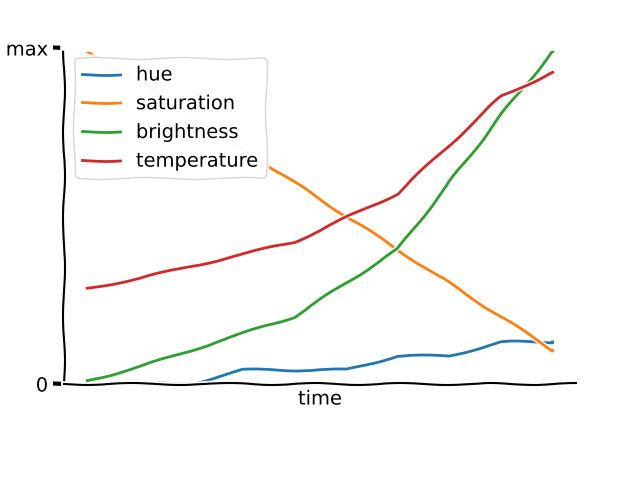

# lifx-night-light
Simple light scenes (wake-up sunrise, wind-down sunset, whatever else) for [LIFX lights](https://www.lifx.com/),
using [lifxlan](https://github.com/mclarkk/lifxlan),
that run from a Pi/computer on your LAN.

My [wake-up light](https://rdrn.me/wake-up-light/) became a bit of a fire hazard,
so I gave up and bought a [LIFX Colour](https://lifxshop.co.uk/products/lifx-colour-e27).

But relying on the cloud for lights seems silly, so I blocked it from the internet
and wrote this script to control it with my Raspberry Pi.



## Installation
```bash
git clone git@github.com:carderne/lifx-night-light.git
cd lifx-pi
python3 -m venv venv
source venv/bin/activate
pip install -e .
```

## Basic usage
Run one of the pre-configured scenes for five minutes:
```bash
lifx-cli sleep --duration=5 --steps=10
```

## Scene configuration
The scenes are stored in [scenes.yml](scenes.yml) and specified as follows:
- `hue` ranges from 0 to 360 in a [color wheel](https://upload.wikimedia.org/wikipedia/commons/a/ad/HueScale.svg)
- `sat` (saturation) from 0 to 100
- `bri` (brightness) from 0 to 100
- `kel` (color temperature) from 0 to 100, will be translated to the range 2500K - 9000K
- `after`: what to do once the transition ends, either 'on' or 'off'

Values will be linearly interpolated so you can provide as many or as few as you like for each variable.

Example:
```yaml
sleep:
  hue: [45, 45, 45, 30, 30, 15, 15, 15, 0, 0, 0]
  sat: [30, 70]
  bri: [20, 15, 10, 5, 4, 3, 2, 1, 0]
  kel: 20    # can just provide a constant like this
  after: on  # optional, defaults to on
```

You can see the existing two scenes in [scenes.yml](scenes.yml), edit them, add more etc.

## More usage examples
See help output:
```bash
lifx-cli --help
```

To run, choose a scene and duration (in minutes):
```bash
lifx-cli wake --duration=10
```

If it lags (slow Raspberry Pi or WiFi), you might want to reduce the number of steps (default is 10,000):
```bash
lifx-cli wake --duration=5 --steps=10
```

You can also a chart of your config as follows. Output will be saved to a PNG with the same name as the config file.
```bash
lifx-cli wake.yml --draw
```

## Web app
There's also a webapp.
Run it as follows:
```bash
FLASK_DEBUG=1 FLASK_APP=lifx_night_light.app.py flask run -h 0.0.0.0
```

And you can add a `systemd`unit something like this to make it run permanently:
```systemd
# /etc/systemd/system/lifx-web.service
[Unit]
Description=Lifx/flask lighting app
After=network.target

[Service]
User=pi
Group=pi
Environment="FLASK_APP=lifx_night_light.app.py"
ExecStart=/home/pi/lifx-pi/venv/bin/flask run -h 0.0.0.0
WorkingDirectory=/home/pi/lifx-pi/
Restart=on-failure
RemainAfterExit=yes

[Install]
WantedBy=multi-user.target
```

Then:
```bash
sudo systemctl enable lifx-web
sudo systemctl start lifx-web
```

## Daemon
The web app relies on [daemon.py](daemon.py). You should make a systemd service for this as well.
Same instructions as above but change these lines (and give it a different name as shown):
```systemd
# /etc/systemd/system/lifx-daemon.service
[Service]
User=pi
Group=pi
ExecStart=/home/pi/lifx-pi/venv/bin/lifx-daemon
WorkingDirectory=/home/pi/lifx-pi/
Restart=on-failure
RemainAfterExit=yes
```

Then enable and start it as above.
